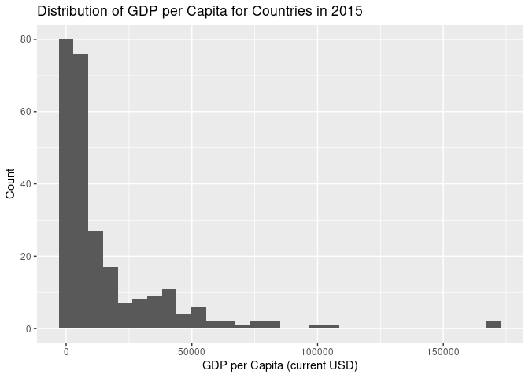
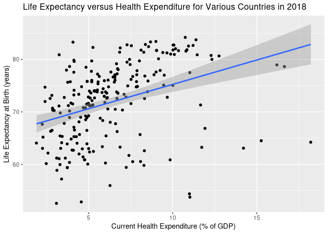

World Development Indicators
================
Brandon Akinseye, Zeke Bickham, Federico Garcia, Carlos Gonzalez,
Gabriel Gray, Kevin Yu
2023-10-05

## Project Description

## Project Goals

The goals of this project are to analyze the relationships between
various world development indicators across the years for all countries.
We hope to gain more insight into factors that affect the quality of
life in a country as well as how countries have developed through the
past few decades.

## Link to Dataset

<https://databank.worldbank.org/source/world-development-indicators>

## Dataset Information

The World Bank DataBank contains time series data on many different
topics for each country in the world. The World Development Indicators
dataset contains metrics about global development through various themes
(e.g. poverty and inequality, people, environment, economy, states and
markets, and global links). The data is compiled from
officially-recognized international sources and contains 1,400 time
series indicators for 217 economies and more than 40 country groups,
with data for many indicators going back more than 50 years.

## Visualizations

``` r
library(readr)
library(tidyverse)
```

    ## ── Attaching core tidyverse packages ──────────────────────── tidyverse 2.0.0 ──
    ## ✔ dplyr     1.1.2     ✔ purrr     1.0.2
    ## ✔ forcats   1.0.0     ✔ stringr   1.5.0
    ## ✔ ggplot2   3.4.3     ✔ tibble    3.2.1
    ## ✔ lubridate 1.9.2     ✔ tidyr     1.3.0
    ## ── Conflicts ────────────────────────────────────────── tidyverse_conflicts() ──
    ## ✖ dplyr::filter() masks stats::filter()
    ## ✖ dplyr::lag()    masks stats::lag()
    ## ℹ Use the conflicted package (<http://conflicted.r-lib.org/>) to force all conflicts to become errors

``` r
library(dplyr)

wdi_data <-read_csv("/stor/home/jzb284/SDS 322E/Project_Data_1.csv", show_col_types = FALSE)

wdi_data %>%
  filter(`Time` == "2015", `GDP per capita (current US$) [NY.GDP.PCAP.CD]` != "..") %>%
  mutate(GDPperCapita = as.numeric(`GDP per capita (current US$) [NY.GDP.PCAP.CD]`)) %>%
  ggplot(aes(x = GDPperCapita)) +
  geom_histogram() +
  xlab("GDP per Capita (current USD)") +
  ylab("Count") +
  ggtitle("Distribution of GDP per Capita for Countries in 2015")
```

    ## `stat_bin()` using `bins = 30`. Pick better value with `binwidth`.

<!-- -->

``` r
wdi_data %>%
  filter(`Time` == "2018",
         `Life expectancy at birth, total (years) [SP.DYN.LE00.IN]` != "..",
         `Current health expenditure (% of GDP) [SH.XPD.CHEX.GD.ZS]` != "..") %>%
  mutate(LifeExpectancy = as.numeric(`Life expectancy at birth, total (years) [SP.DYN.LE00.IN]`),
         HealthExpend = as.numeric(`Current health expenditure (% of GDP) [SH.XPD.CHEX.GD.ZS]`)) %>%
  ggplot(aes(x = HealthExpend, y = LifeExpectancy)) +
  geom_point() +
  geom_smooth(method = "lm") +
  xlab("Current Health Expenditure (% of GDP)") +
  ylab("Life Expectancy at Birth (years)") +
  ggtitle("Life Expectancy versus Health Expenditure for Various Countries in 2018")
```

    ## `geom_smooth()` using formula = 'y ~ x'

<!-- -->

## Hypotheses

## References

The following is a link to The World Bank DataBank:
<https://databank.worldbank.org/source/world-development-indicators>
