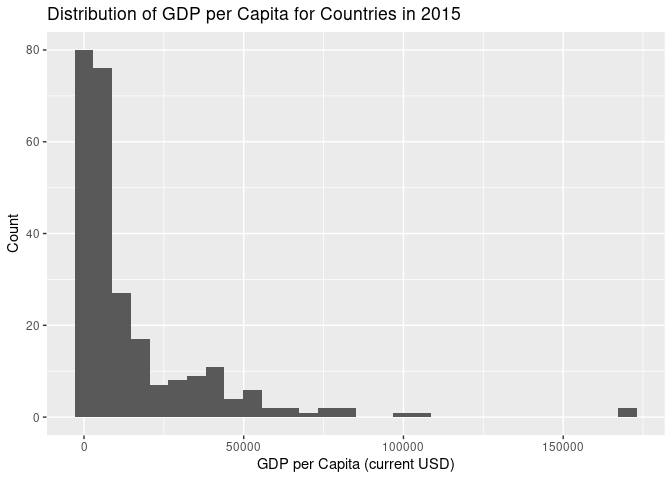
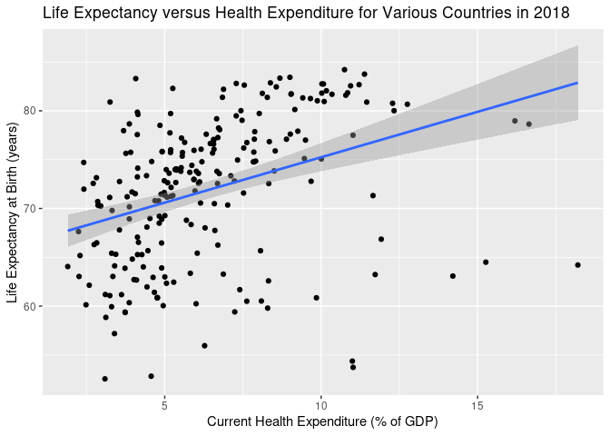

World Development Indicators
================
Brandon Akinseye, Zeke Bickham, Freddy Garcia, Carlos Gonzalez, Gabriel
Gray, Kevin Yu
2023-10-05

## Project Description

The World Development Indicators dataset is a dataset obtained from the World Bank website.
With 1477 different variables to chose from, World Banks gives freedom to choose which 
are to be manipulated and can be downloaded as CSV or Excel file. As of October 6, 2023,
the World Development Indicators datasheet contains 1477 different columns with 266 different
rows of observations (countries) that can be sorted across years 1975 to 2023. 

## Project Goals

The goals of this project are to analyze the relationships between
various world development indicators across the years for all countries.
We hope to gain more insight into factors that affect the quality of
life in a country as well as how countries have developed through the
past few decades.

## Link to Dataset

<https://databank.worldbank.org/source/world-development-indicators>

## Dataset Information

The World Bank DataBank contains time series data on many different
topics for each country in the world. The World Development Indicators
dataset contains metrics about global development through various themes
(e.g. poverty and inequality, people, environment, economy, states and
markets, and global links). The data is compiled from
officially-recognized international sources and contains 1,400 time
series indicators for 217 economies and more than 40 country groups,
with data for many indicators going back more than 50 years.

Some variables include but are not limited to: GNI, GDP, Labor force 
Participation, Literacy Rate, Net Migration, School Enrollment, 
%Higher Education, Current Health Expenditure, Life Expectancy, etc. 

## Hypotheses

1.  If a country spends more on healthcare, then their population will
    live healthier lives, as demonstrated by their life expectancy.
    
3.  As education rates increase, we should subsequently see variance in
    infant mortality rate, as higher education rates results in better
    knowledge of infant care, and sebsequently a lower mortality rate. 

## Visualizations

## 

## References

The following is a link to The World Bank DataBank:
<https://databank.worldbank.org/source/world-development-indicators>
